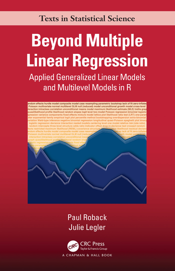
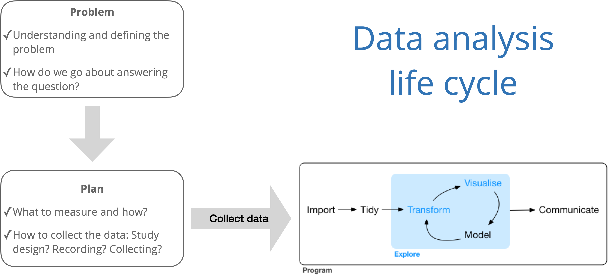

```{r check-paths, echo=TRUE}
.libPaths()
R.version.string
```


# Welcome!

## Instructor

- : [](mailto:acannon@cornellcollege.edu)


## Course logistics

- Course Dates: 
- Course sessions: 
- Exam Dates: 


## What we're covering this block (1/3)

**Generalized Linear Models (Ch 1 - 6)**

- Introduce models for non-normal response variables
- Estimation, interpretation, and inference
- Mathematical details showing how GLMs are connected


## Generalized Linear Models {.smaller}

*In statistics, a generalized linear model (GLM) is a flexible generalization of ordinary linear regression. The GLM generalizes linear regression by allowing the linear model to be related to the response variable via a link function and by allowing the magnitude of the variance of each measurement to be a function of its predicted value.* 

::: aside

[Wikipedia](https://en.wikipedia.org/wiki/Generalized_linear_model)

:::

. . .

**Logistic regression**

$$\begin{aligned}\pi = P(y = 1 | x) \hspace{2mm} &\Rightarrow \hspace{2mm} \text{Link function: } \log\big(\frac{\pi}{1-\pi}\big) \\
&\Rightarrow \log\big(\frac{\pi}{1-\pi}\big) = \beta_0 + \beta_1~x\end{aligned}$$


## What we're covering this block (2/3)

**More Regression Models (ITSL Chapter 7)**
- Polynomial Regression
- Regression Splines
- Smoothing Splines
- Generalized Additive Models (GAMS)


## What we're covering this block (3/3)

**Modeling correlated data (Ch 7 - 9)**

- Introduce multilevel models for correlated and longitudinal data
- Estimation, interpretation, and inference
- Mathematical details, particularly diving into covariance structures


## What background is assumed for the course? {.smaller}

. . .

**Pre-reqs**

- STA 201, 202 and DSC 223

. . .

**Background knowledge** 

:::: {.columns}

::: {.column }
- Statistical content
  - Linear and logistic regression 
  - Statistical inference
  - Basic understanding of random variables
  
:::

::: {.column}
- Computing 
  - Using R for data analysis
  - Writing reports using R Markdown or Quarto
  
:::
::::

## Course Toolkit (1/2)


- **Website**
  - []()
  - Central hub for the course
  - Notes
  - Labs


## Course Toolkit (2/2){.smaller}

- **Moodle**: 
  - []()
  - Submissions
  - Announcements
  
- **R Server**:
  - []({{ var college.rstudio >}})
  - Datasets
  - Quarto file storage


## Class Meetings 

- Lecture
- Individual and group labs
- Mini-projects
- Exams
- Bring a fully-charged laptop

. . .

**Attendance is expected (if you are healthy!)**


## Textbook

:::: {.columns}

::: {.column }




:::

::: {.column}
*Beyond Multiple Linear Regression* by Paul Roback and Julie Legler

- Available [online](https://bookdown.org/roback/bookdown-BeyondMLR/)
- Hard copies available for purchase

:::
::::

## Textbook 2



- Hard copies available for purchase


## Using R / RStudio
- RStudio Server is installed and should be used
- []()


## Activities & Assessments {.smaller}


**Readings**

- Primarily from *Beyond Multiple Linear Regression* 
- Recommend reading assigned text before lecture

. . .

**Homework**
- Primarily from *Beyond Multiple Linear Regression* 

- Individual assignments

- Work together but must complete your own work. Discuss but don't copy. 


## Activities & Assessments {.smaller}

**Mini-projects**

- Mini-project 01: Focused on logistic regression models
- Mini-project 02: Focused on models for response variables that represent count data
- Mini-project 03: Focused on data collected at multiple levels

. . .

- Short write up and short presentation
- Team-based


## Exams
- Two exams this block, . 

- Each will have two components
  - Component 1 will be on these dates and will be a closed-book, closed-note, in-class exam.
  - Component 2 will be a take-home, open-book, open-note exam. 
  - You will have 12 hours or more to complete the second component. 


## Grading

Final grades will be calculated as follows


| Category              | Points     |
|-----------------------|------------|
| Homework              | 300        |
| Labs & Participation  | 75         |
| Mini Projects         | 225        |
| Exams                 | 400        |
| Total                 | 1000       |


## Resources {.smaller}

- **Office hours** to meet with your instructor in 
  - Typically 

- **Email**  for private questions regarding personal matters or grades. 

- College support at []().

# Chapter 1 - Linear Regression Review

## Setup - R Packages

```{r echo=T, message=FALSE, warning=FALSE}
library(tidyverse)
library(tidymodels)
library(latex2exp)
library(GGally)
library(knitr)
library(patchwork)
library(viridis)
library(ggfortify)
library(tailor)
derby <- read_csv("data/derbyplus.csv")
```

## Simple linear regression {.smaller}


[Simplest case]{.fragment fragment-index=0}


[$X=$ explanatory variable]{.fragment fragment-index=1 style="padding-left: 20px;"}

[$Y=$ response variable]{.fragment fragment-index=2 style="padding-left: 20px;"}

[Both variables are quantitative]{.fragment fragment-index=3 style="padding-left: 20px;"}


<br>


[Model]{.fragment fragment-index=4}


[$Y_i = \beta_0 + \beta_1 x_i + \epsilon_i$ where $\epsilon_i \sim N\left( 0,\sigma^2\right)$]{.fragment fragment-index=5 style="padding-left: 20px;"}
  

::: {#slide-right-box .absolute .fragment top="70%" left="45%" width="30%" height="20%" style="background-color: #e6f2ff; border: 2px solid #0066cc; border-radius: 8px; padding: 20px; font-size: 0.75em;" fragment-index=6}
### Note 
The book uses $\sigma^2$ in this notation, not $\sigma$ as we did in STA 201 and STA 202

:::


## Assumptions for linear regression {.smaller}

What are the assumptions for linear regression? 
. . .

**L**inearity: Linear relationship between mean response and predictor variable(s) 

. . .

**I**ndependence: Residuals are independent. There is no connection between how far any two points lie above or below regression line.

. . .

**N**ormality: Response follows a normal distribution at each level of the predictor (or combination of predictors)

. . .

**E**qual variance: Variability (variance or standard deviation) of the response is equal for all levels of the predictor (or combination of predictors)

. . .

**Use residual plots to check that the conditions hold before using the model for statistical inference.**


## Assumptions for linear regression {.smaller}

:::: {.columns}
::: {.column width="40%"}
```{r echo = F, out.width = "100%"}
##   Code modified from https://stackoverflow.com/questions/31794876/ggplot2-how-to-curve-small-gaussian-densities-on-a-regression-line?rq=1

## Modified based on BYSH: https://bookdown.org/roback/bookdown-bysh/ch-MLRreview.html#ordinary-least-squares-ols-assumptions

set.seed(0)
dat <- data.frame(x=(x=runif(10000, 0, 50)),
                  y=rnorm(10000, 10*x, 100))

## breaks: where you want to compute densities
breaks <- seq(0, max(dat$x), len=5)
dat$section <- cut(dat$x, breaks)

## Get the residuals
dat$res <- residuals(lm(y ~ x, data=dat))

## Compute densities for each section, and flip the axes, and add means of sections
## Note: the densities need to be scaled in relation to the section size (2000 here)
dens <- do.call(rbind, lapply(split(dat, dat$section), function(x) {
    d <- density(x$res, n=50)
    res <- data.frame(x=max(x$x)- d$y*2000, y=d$x+mean(x$y))
    res <- res[order(res$y), ]
    ## Get some data for normal lines as well
    xs <- seq(min(x$res), max(x$res), len=50)
    res <- rbind(res, data.frame(y=xs + mean(x$y),
                                 x=max(x$x) - 2000*dnorm(xs, 0, sd(x$res))))
    res$type <- rep(c("empirical", "normal"), each=50)
    res
}))
dens$section <- rep(levels(dat$section), each=100)

dens <- dens |>
  filter(type == "normal")

## Plot both empirical and theoretical
ggplot(dat, aes(x, y)) +
  geom_point(alpha = 0.05, size = 0.2) +
  geom_smooth(method="lm", fill=NA, se = FALSE, color = "steelblue") +
  geom_path(data=dens, aes(x, y, group=interaction(section)), color = "red", lwd=1.1) +
geom_vline(xintercept=breaks, lty=2, color = "grey") +
  labs(x = "x", 
       y = "y") +
  theme_classic() + 
  annotate("text", x = 10, y = 600, 
           label = as.character(TeX("$\\mu_{Y|X} = \\beta_0 + \\beta_1X$")), color = "steelblue", size = 8,
           parse=T) +
  annotate("text", x = 20, y = 400, 
           label = as.character(TeX("$\\sigma^2$")), color = "red", size = 8,
           parse = T) +
  theme(axis.title = element_text(size = 16),
        axis.ticks = element_blank(), 
        axis.text.x = element_blank(), 
       axis.text.y = element_blank()
      )
  
```


::: aside
Modified from Figure 1.1. in BMLR]
:::

:::

::: {.column width = "60%"}

- **L**inearity: Linear relationship between mean of the response $Y$ and the predictor $X$

- **I**ndependence: No connection between how any two points lie above or below the regression line

- **N**ormality: Response, $Y$, follows a normal distribution at each level of the predictor, $X$ (indicated by red curves)

- **E**qual variance: Variance (or standard deviation) of the response, $Y$, is equal for all levels of the predictor, $X$

:::
::::


## Example

Sea ice data

```{r}
si <- read_csv("data/seaice.csv")
head(si)
```

## Sea ice data information {.smaller}

The National Oceanic and Atmospheric Administration measures the amount of sea ice in both the arctic and antarctic on a regular basis (at least daily). 

Our data:

 - Average amount of ice for the month of September in the Arctic
 
 - September is the month with the least amount of ice in the Arctic
 
 - Data from 1979 - 2025 (September isn't over yet so we don't have 2026 yet)
 - Area = the total region covered by ice
 
 - Extent = the total region with at least 15% ice cover (think about a slice of swiss cheese)


## Is the relationship linear? 

::: {.panel-tabset}

### Plot

```{r echo = F,fig.height=5}
ggplot(data = si, aes(x = year, y = extent)) + 
  geom_point() + 
  geom_smooth(method = "lm", se = FALSE) + 
  labs(x = "Year", y = "Extent of Ice", 
       title = "Year vs. Extent of Ice") 
```

### Code 

```{r eval = F, echo = T}
ggplot(data = si, aes(x = year, y = extent)) + 
  geom_point() + 
  geom_smooth(method = "lm", se = FALSE) + 
  labs(x = "Year", y = "Extent of Ice", 
       title = "Year vs. Extent of Ice") 
```

:::

## Compute the model 


::: {.panel-tabset}

### Output

```{r echo = F}
model1 <- lm(extent ~ year, data=si)
tidy(model1) |> kable(digits = 3)
```

### Code 

```{r simplemodel-code, eval = F}
# Fit and display model
model1 <- lm(extent ~ year, data=si)
tidy(model1) |> kable(digits = 3)
```

:::

## Interpretation {.smaller}

$$\widehat{extent} = 158.155 - 0.076 ~ year$$


```{r echo = F}
model1 <- lm(extent ~ year, data=si)
tidy(model1) |> kable(digits = 3)
```

. . .


1. Write out the interpretations for `year`. 
2. Does the intercept have a meaningful interpretation? 


## Center the data

::: {.panel-tabset}

### Create new variable

 - We only have data starting in 1979.  So let's call that year 0.  The data at the beginning of the study.

 - Create a new variable: $time = year - 1979$
 
 - This is called centering
 
```{r  eval = T, echo=F}
# Fit and display model
si |>
  mutate(c_year = year-1979) -> si
``` 
 
### Code 

```{r  eval = F}
# Fit and display model
si |>
  mutate(c_year = year-1979) -> si
```

:::

## Interpret new model {.smaller}

$$\widehat{extent} = 7.625 - 0.076 ~ year$$


```{r echo = F}
model2 <- lm(extent ~ c_year, data=si)
tidy(model2) |> kable(digits = 3)
```

. . .


Questions:

 - 1. What is the interpretation of the y-intercept now? 
 
 - 2. Did the slope change?


 

## Check assumptions {.smaller}

::: {.panel-tabset}

### Output

```{r echo = F}
par(mfrow=c(2,2))

plot(model2, pch=16, col='#006EA1')
```

### Code 

```{r diag-plots, eval = F}
# Plot the diagnostic plots
par(mfrow=c(2,2))

plot(model2, pch=16, col='#006EA1')
```

`pch` defines the shape of the plotted symbol

`col` defines the color of the plotted symbol
:::

## What about the curvature?

Try polynomial regression:

$$y_i = \beta_0 + \beta_1 ~ x_i + \beta_2 ~x_i^2 + \beta_3 ~ x_i^3 ... + \beta_d ~ x_i^d + \epsilon_i $$
 
 . . .

In this case, maybe a cubic (why?):

$$\widehat{extent} = \hat{\beta}_0 + \hat{\beta}_1 ~ c\_year + \hat{\beta}_2 ~c\_year^2 + \hat{\beta}_3 ~ c\_year^3 $$

## New model {.smaller}

::: {.panel-tabset}

### Output

```{r echo = F}
model3 <- lm(extent ~ poly(c_year, 3), data=si)
tidy(model3) |> kable(digits = 3)
```

### Code 

```{r  eval = F}
# Fit and display model
model3 <- lm(extent ~ poly(c_year,3), data=si)
tidy(model3) |> kable(digits = 3)
```

:::

## Check assumptions {.smaller}

::: {.panel-tabset}

### Output

```{r echo = F}
par(mfrow=c(2,2))

plot(model3, pch=16, col='#006EA1')
```

### Code 

```{r  eval = F}
# Plot the diagnostic plots
par(mfrow=c(2,2))

plot(model3, pch=16, col='#006EA1')
```


:::


## Review of multiple linear regression 


## Data: Saratoga house prices {.smaller}


Data from homes for sale in Saratoga, NY.  The data is about 15 years old.

. . .

::::{.columns}
:::{.column}

**Response variable**

- `Price`: Price of the home in 1000s of dollars

:::

:::{.column}

**Predictor/Explanatory variables**

- `Size`: Size of the home in 1000s of square feet
- `Baths`: Number of bathrooms
- `Bedrooms`: Number of bedrooms
- `Fireplace`: Does it have a fireplace? 0 = No, 1 = Yes
- `Acres`: Size of the lot in acres
- `Age`:  Age of the home

:::


::::


## Data {.smaller}

```{r}
saratoga <- read_csv("data/saratoga.csv")
```

```{r}
saratoga |>
  head(5) |> kable()
```

## Data Analysis Life Cycle




## Exploratory data analysis (EDA) {.smaller}

- Once you're ready for the statistical analysis (explore), the first step should always be **exploratory data analysis**.

- The EDA will help you 
  - begin to understand the variables and observations
  - identify outliers or potential data entry errors
  - begin to see relationships between variables
  - identify the appropriate model and identify a strategy

- The EDA is exploratory; formal modeling and statistical inference should be used to draw conclusions.


## Plots for univariate EDA


::: {.panel-tabset}

### Plot 

```{r univar-eda-plot, echo = F}
p1 <- ggplot(data = saratoga, aes(x = Price)) + 
  geom_histogram(fill = "forestgreen", color = "black") + 
  labs(x = "Price ($1000)", y = "Count")

p2 <- ggplot(data = saratoga, aes(x = Size)) + 
  geom_histogram(fill = "forestgreen", color = "black") + 
  labs(x = "Size (1000 sqft)", y = "Count")

p3 <- ggplot(data = saratoga, aes(x = Baths)) +
   geom_bar(fill = "forestgreen", color = "black", aes(x = ))

p1 + (p2 / p3) + 
  plot_annotation(title = "Univariate data analysis")
```


### Code 

```{r  eval = F}
p1 <- ggplot(data = saratoga, aes(x = Price)) + 
  geom_histogram(fill = "forestgreen", color = "black") + 
  labs(x = "Price ($1000)", y = "Count")

p2 <- ggplot(data = saratoga, aes(x = Size)) + 
  geom_histogram(fill = "forestgreen", color = "black") + 
  labs(x = "Size (1000 sqft)", y = "Count")

p3 <- ggplot(data = saratoga, aes(x = Baths)) +
   geom_bar(fill = "forestgreen", color = "black", aes(x = ))

p1 + (p2 / p3) + 
  plot_annotation(title = "Univariate data analysis")
```

:::


## Plots for univariate EDA (cont.)


::: {.panel-tabset}

### Plot 

```{r univar-eda-plot3, echo = F}
p1 <- ggplot(data = saratoga, aes(x = Bedrooms)) + 
  geom_bar(fill = "forestgreen", color = "black", aes(x=))

p2 <- ggplot(data = saratoga, aes(x = Acres)) + 
  geom_histogram(fill = "forestgreen", color = "black") + 
  labs(x = "Size of lot (acres)", y = "Count")

p3 <- ggplot(data = saratoga, aes(x = Fireplace)) +
   geom_bar(fill = "forestgreen", color = "black", aes(x = ))

p4 <- ggplot(data = saratoga, aes(x = Age)) + 
  geom_histogram(fill = "forestgreen", color = "black") + 
  labs(x = "Age (years", y = "Count")

(p1 + p2) /(p3+p4)  + 
  plot_annotation(title = "Univariate data analysis")
```


### Code 

```{r  eval = F}
p1 <- ggplot(data = saratoga, aes(x = Bedrooms)) + 
  geom_bar(fill = "forestgreen", color = "black", aes(x=))

p2 <- ggplot(data = saratoga, aes(x = Acres)) + 
  geom_histogram(fill = "forestgreen", color = "black") + 
  labs(x = "Size of lot (acres)", y = "Count")

p3 <- ggplot(data = saratoga, aes(x = Fireplace)) +
   geom_bar(fill = "forestgreen", color = "black", aes(x = ))

p4 <- ggplot(data = saratoga, aes(x = Age)) + 
  geom_histogram(fill = "forestgreen", color = "black") + 
  labs(x = "Age (years", y = "Count")

(p1 + p2) / (p3 + p4)  + 
  plot_annotation(title = "Univariate data analysis")
```

:::


## Plots for bivariate EDA {.smaller}

::: {.panel-tabset}

### Plot

```{r bivar-eda-plot, echo = F}
p5 <- ggplot(data = saratoga, aes(x = Size, y = Price)) + 
  geom_point() + 
  labs(x = "Size (1000 sq ft)", y = "Price ($1000)")

p6 <- ggplot(data = saratoga, aes(x = Age, y = Price)) + 
  geom_point() + 
  labs(x = "Age (years)", y = "Price ($1000")

p7 <- ggplot(data = saratoga, aes(x = as.factor(Fireplace), y = Price)) + 
  geom_boxplot(fill = "forestgreen", color = "black") + 
  labs(x = "Fireplace (0 = no, 1 = yes)", y = "Price ($1000")

(p5 + p6) / p7 +
  plot_annotation(title = "Bivariate data analysis")
```

### Code


```{r bivar-eda, eval = F}
p5 <- ggplot(data = saratoga, aes(x = Size, y = Price)) + 
  geom_point() + 
  labs(x = "Size (1000 sq ft)", y = "Price ($1000)")

p6 <- ggplot(data = saratoga, aes(x = Age, y = Price)) + 
  geom_point() + 
  labs(x = "Age (years)", y = "Price ($1000")

p7 <- ggplot(data = saratoga, aes(x = as.factor(Fireplace), y = Price)) + 
  geom_boxplot(fill = "forestgreen", color = "black") + 
  labs(x = "Fireplace (0 = no, 1 = yes)", y = "Price ($1000")

(p5 + p6) / p7 +
  plot_annotation(title = "Bivariate data analysis")
```

:::

## Scatterplot matrix {.smaller}


A **scatterplot matrix** helps quickly visualize relationships between many variable pairs. They are particularly useful to identify potentially correlated predictors.

. . .

::: {.panel-tabset}

### Plot
```{r scatterplot-matrix-plot, echo = F, fig.height=3.5}
#library(GGally)
ggpairs(data = saratoga)
```


### Code 

```{r scatterplot-matrix, eval = F}
#library(GGally)
ggpairs(data = saratoga)
```

:::


## Plots for multivariate EDA {.smaller}

Plot the relationship between the response and a predictor based on levels of another predictor to assess potential interactions. 

::: {.panel-tabset}

### Plot

```{r multivar-eda-plot, echo = F,fig.height=3.5}
library(viridis)
saratoga$fire <- as.factor(saratoga$Fireplace)
ggplot(data = saratoga, aes(x = Size, y = Price, color = fire, 
                         shape = fire, linetype = fire)) + 
  geom_point() + 
  geom_smooth(method = "lm", se = FALSE, aes(linetype = fire)) + 
  labs(x = "Size (1000 sq ft)", y = "Price ($1000)", color = "Fireplace",
       title = "Price vs. size", 
       subtitle = "by whether it has a fireplace or not") +
  guides(lty = FALSE, shape = FALSE) +
  scale_color_viridis_d(alpha = 0.6, end = 0.8) 
```

### Code 

```{r multivar-eda, eval = F}
#library(viridis)
saratoga$fire <- as.factor(saratoga$Fireplace)
ggplot(data = saratoga, aes(x = Size, y = Price, color = fire, 
                         shape = fire, linetype = fire)) + 
  geom_point() + 
  geom_smooth(method = "lm", se = FALSE, aes(linetype = fire)) + 
  labs(x = "Size (1000 sq ft)", y = "Price ($1000)", color = "Fireplace",
       title = "Price vs. size", 
       subtitle = "by whether it has a fireplace or not") +
  guides(lty = FALSE, shape = FALSE) +
  scale_color_viridis_d(alpha = 0.6, end = 0.8) 
```

:::


## Model 1: Main effects model {.smaller}

::: {.panel-tabset}

### Output

```{r echo = F}
pr.model1 <- lm(Price ~ Size + Baths + Bedrooms + Size + Acres + Fireplace + Age, data = saratoga)
tidy(pr.model1) |> kable(digits = 3)
```

### Code 

```{r model1-code, eval = F}
# Fit and display model
pr.model1 <- lm(Price ~ Size + Baths + Bedrooms + Size + Acres + Fireplace + Age, data = saratoga)
tidy(pr.model1) |> kable(digits = 3)
```

:::

## [Interpretation]{style="font-size: 75%;"} {.smaller}

$$
\begin{aligned}
\widehat{Price} = & 0.950 + 80.073 ~ Size + 25.279 ~ Baths - 9.014 ~ Bedrooms + 1.887 ~ Acres \\
& + 4.844 ~ Fireplace - 0.064 ~ Age
 \end{aligned}
$$

::::{.columns}

:::{.column}

```{r echo = F}
pr.model1 <- lm(Price ~ Size + Baths + Bedrooms + Size + Acres + Fireplace + Age, data = saratoga)
tidy(pr.model1) |> select(term, estimate) |> kable(digits = 3)
```

:::

:::{.column}

1. Write out the interpretations for `Size` and `Fireplace`. 
2. Does the intercept have a meaningful interpretation? 

:::

::::


## Model 1: Check model assumptions {.smaller}

::: {.panel-tabset}

### Plots

```{r echo=FALSE}
#library(ggfortify)
par(mfrow=c(2,2))

plot(pr.model1, pch=16, col='#006EA1')
```

### Code

```{r eval=FALSE}
#library(ggfortify)
par(mfrow=c(2,2))

plot(pr.model1, pch=16, col='#006EA1')
```


### Questions

Which of the model assumptions (LINE) does this pass and/or fail? 


:::

## Model 2: Add interaction term for Fireplace and Size? {.smaller}

::: {.panel-tabset}

### Plot

```{r multivar-eda-plot2, echo = F,fig.height=3.5}
library(viridis)
saratoga$fire <- as.factor(saratoga$Fireplace)
ggplot(data = saratoga, aes(x = Size, y = Price, color = fire, 
                         shape = fire, linetype = fire)) + 
  geom_point() + 
  geom_smooth(method = "lm", se = FALSE, aes(linetype = fire)) + 
  labs(x = "Size (1000 sq ft)", y = "Price ($1000)", color = "Fireplace",
       title = "Price vs. size", 
       subtitle = "by whether it has a fireplace or not") +
  guides(lty = FALSE, shape = FALSE) +
  scale_color_viridis_d(alpha = 0.6, end = 0.8) 
```

### Code 

```{r eval = F}
#library(viridis)
#saratoga$fire <- as.factor(saratoga$Fireplace)
ggplot(data = saratoga, aes(x = Size, y = Price, color = fire, 
                         shape = fire, linetype = fire)) + 
  geom_point() + 
  geom_smooth(method = "lm", se = FALSE, aes(linetype = fire)) + 
  labs(x = "Size (1000 sq ft)", y = "Price ($1000)", color = "Fireplace",
       title = "Price vs. size", 
       subtitle = "by whether it has a fireplace or not") +
  guides(lty = FALSE, shape = FALSE) +
  scale_color_viridis_d(alpha = 0.6, end = 0.8) 
```

:::


## Model 2: Add $Fireplace * Size$ {.smaller}

::: {.panel-tabset}

### Output

```{r echo = F}
pr.model2 <- lm(Price ~ Size + Baths + Bedrooms  + Acres + Fireplace  + Age + Fireplace*Size, data = saratoga)
tidy(pr.model2) |> kable(digits = 4)
```

### Code 

```{r  eval = F}
pr.model2 <- lm(Price ~ Size + Baths + Bedrooms + Acres + Fireplace + Age +Fireplace*Size, data = saratoga)
tidy(pr.model2) |> kable(digits = 4)
```

:::


## Interpreting interaction effects with 0/1 variable

$$
\begin{aligned}
\hat{y}& = \hat{\beta}_0 + \hat{\beta}_1 ~ x_1  + \hat{\beta}_2 ~ x_2 + \hat{\beta}_3 ~x_3 +\hat{\beta}_4 ~ x_1~x_2\\
 & = \hat{\beta}_0 + \hat{\beta}_1 ~ x_1 + \hat{\beta}_3 ~x_3\hspace{3.9 in} \text{  when } x_2=0\\
 & = (\hat{\beta}_0 +\hat{\beta}_2) + (\hat{\beta}_1 + \hat{\beta}_4) ~ x_1 +\hat{\beta}_3~x_3\hspace{.75 in} \text{  when } x_2=1
\end{aligned}
$$


**General interpretation**: When $x_2$ is present, the slope between $x_1$ and $y$ increases(decreases) by $\hat{\beta}_4$ units and the $y$-intercept increases(decreases) by $\hat{\beta}_2$ units when all other variables are held constant.


## Interpreting interaction effects {.smaller}

$$\begin{aligned}\widehat{Price} = &45.00 + 48.33 ~ Size + 25.79 ~ Baths - 8.95 ~ Bedrooms \\
& + 2.01 ~ Acres - 59.30 ~ Fireplace - 0.05 ~ Age + 40.51~Fireplace * Size\end{aligned}$$

. . .

Question: 

*Interpret the effect that having a fireplace has on the relationship between size and price.*


## Model 2: Check model assumptions

```{r, echo = F}
par(mfrow=c(2,2))

plot(pr.model2, pch=16, col='#006EA1')
```


## Model 3: Try ln of response and delete some variables {.smaller}


::: {.panel-tabset}

### Output

```{r echo = F}
pr.model3 <- lm(log(Price) ~ Size + Baths + Bedrooms +  Fireplace  + Fireplace*Size, data = saratoga)
tidy(pr.model3) |> kable(digits = 3)
```

### Code 

```{r  eval = F}
pr.model3 <- lm(log(Price) ~ Size + Baths + Bedrooms  + Fireplace  + Fireplace*Size, data = saratoga)
tidy(pr.model3) |> kable(digits = 3)
```

:::

## Model 4: Fewer terms yet {.smaller}


::: {.panel-tabset}

### Output

```{r echo = F}
pr.model4 <- lm(log(Price) ~ Size + Baths, data = saratoga)
tidy(pr.model4) |> kable(digits = 3)
```

### Code 

```{r  eval = F}
pr.model4 <- lm(log(Price) ~ Size + Baths, data = saratoga)
tidy(pr.model4) |> kable(digits = 3)
```


### Assumptions

```{r, echo = F}
par(mfrow=c(2,2))

plot(pr.model4, pch=16, col='#006EA1')
```


:::

## Which model would you choose?

::: {.panel-tabset}


### Model 1: Main effects

```{r echo = F}
glance(pr.model1) |>
  select(r.squared, adj.r.squared, AIC, BIC) |>
  kable(digits = 3)
```

### Model 2: Main effects + interaction

```{r echo = F}
glance(pr.model2) |>
  select(r.squared, adj.r.squared, AIC, BIC) |>
  kable(digits = 3)
```

### Model 4: Small model

```{r echo = F}
glance(pr.model4) |>
  select(r.squared, adj.r.squared, AIC, BIC) |>
  kable(digits = 3)
```

### Code

```{r eval = FALSE}
# Model 1
glance(pr.model1) |>
  select(r.squared, adj.r.squared, AIC, BIC) |>
  kable(digits = 3)

# Model2
glance(pr.model2) |>
  select(r.squared, adj.r.squared, AIC, BIC) |>
  kable(digits = 3)

# Model 4
glance(pr.model4) |>
  select(r.squared, adj.r.squared, AIC, BIC) |>
  kable(digits = 3)
```

:::

## What are these model quality metrics? 

- **How do we define RSquared?**

- **What is adj.r.squared?**


## Measures of model performance {.smaller}

- $\color{#4187aa}{R^2}$: Proportion of variability in the response explained by the model.
  -  Will always increase as predictors are added, so it shouldn't be used to compare models
  
- $\color{#4187aa}{Adj. R^2}$: Similar to $R^2$ with a penalty for extra terms

. . .

- $\color{#4187aa}{AIC}$: Likelihood-based approach balancing model performance and complexity

- $\color{#4187aa}{BIC}$: Similar to AIC with stronger penalty for extra terms

. . . 

- **Nested F Test (extra sum of squares F test)**: Generalization of t-test for individual coefficients to perform significance tests on nested models


## Which model would you choose? {.smaller}

Use the **`glance`** function to get model statistics.

::: {.panel-tabset}

### Output

```{r echo = F}
model1_glance <- glance(pr.model1) |>
  select(r.squared, adj.r.squared, AIC, BIC)
model2_glance <- glance(pr.model2) |>
  select(r.squared, adj.r.squared, AIC, BIC)
model4_glance <- glance(pr.model4) |>
  select(r.squared, adj.r.squared, AIC, BIC)

model1_glance |>
  bind_rows(model2_glance) |>
  bind_rows(model4_glance) |>
  bind_cols(model = c("Model1", "Model2", "Model4")) |>
  select(model, everything()) |>
kable(digits = 3)
```


### Code 

```{r echo = T,eval = F}
model1_glance <- glance(pr.model1) |>
  select(r.squared, adj.r.squared, AIC, BIC)
model2_glance <- glance(pr.model2) |>
  select(r.squared, adj.r.squared, AIC, BIC)
model4_glance <- glance(pr.model4) |>
  select(r.squared, adj.r.squared, AIC, BIC)

model1_glance |>
  bind_rows(model2_glance) |>
  bind_rows(model4_glance) |>
  bind_cols(model = c("Model1", "Model2", "Model4")) |>
  select(model, everything()) |>
kable(digits = 3)
```

:::

## Characteristics of a "good" final model {.smaller}

- Model can be used to answer primary research questions
- Predictor variables control for important covariates
- Potential interactions have been investigated
- Variables are centered, as needed, for more meaningful interpretations 
- Unnecessary terms are removed 
- Assumptions are met and influential points have been addressed
- Model tells a "persuasive story parsimoniously"

::: aside
[List from Section 1.6.7 of BMLR](https://bookdown.org/roback/bookdown-BeyondMLR/)
:::


## Inference for multiple linear regression {.smaller}

Use statistical inference to 

- Determine if predictors are statistically significant (not necessarily practically significant!)
- Quantify uncertainty in coefficient estimates
- Quantify uncertainty in model predictions

. . .

If L.I.N.E. assumptions are met, we can conduct inference using the $t$ distribution and estimated standard errors 

## Inference for regression {.smaller}

::: {.panel-tabset}

### When L.I.N.E. conditions are met 

```{r echo = F, out.width = "100%"}
##   Code modified from https://stackoverflow.com/questions/31794876/ggplot2-how-to-curve-small-gaussian-densities-on-a-regression-line?rq=1

## Modified based on BYSH: https://bookdown.org/roback/bookdown-bysh/ch-MLRreview.html#ordinary-least-squares-ols-assumptions

set.seed(0)
dat <- data.frame(x=(x=runif(10000, 0, 50)),
                  y=rnorm(10000, 10*x, 100))

## breaks: where you want to compute densities
breaks <- seq(0, max(dat$x), len=5)
dat$section <- cut(dat$x, breaks)

## Get the residuals
dat$res <- residuals(lm(y ~ x, data=dat))

## Compute densities for each section, and flip the axes, and add means of sections
## Note: the densities need to be scaled in relation to the section size (2000 here)
dens <- do.call(rbind, lapply(split(dat, dat$section), function(x) {
    d <- density(x$res, n=50)
    res <- data.frame(x=max(x$x)- d$y*2000, y=d$x+mean(x$y))
    res <- res[order(res$y), ]
    ## Get some data for normal lines as well
    xs <- seq(min(x$res), max(x$res), len=50)
    res <- rbind(res, data.frame(y=xs + mean(x$y),
                                 x=max(x$x) - 2000*dnorm(xs, 0, sd(x$res))))
    res$type <- rep(c("empirical", "normal"), each=50)
    res
}))
dens$section <- rep(levels(dat$section), each=100)

dens <- dens %>%
  filter(type == "normal")

## Plot both empirical and theoretical
ggplot(dat, aes(x, y)) +
  geom_point(alpha = 0.05, size = 0.2) +
  geom_smooth(method="lm", fill=NA, se = FALSE, color = "steelblue") +
  geom_path(data=dens, aes(x, y, group=interaction(section)), color = "red", lwd=1.1) +
geom_vline(xintercept=breaks, lty=2, color = "grey") +
  labs(x = "x", 
       y = "y") +
  theme_classic() + 
  annotate("text", x = 10, y = 600, 
           label = as.character(TeX("$\\mu_{Y|X} = \\beta_0 + \\beta_1X$")), 
           color = "steelblue", size = 8, parse = T) +
  annotate("text", x = 20, y = 400, 
           label = as.character(TeX("$\\sigma^2$")), color = "red", size = 8,
           parse = T) +
  theme(axis.title = element_text(size = 16),
        axis.ticks = element_blank(), 
        axis.text.x = element_blank(), 
       axis.text.y = element_blank()
      )
  
```

### We can

- Use least squares regression to get the estimates $\hat{\beta}_0$, $\hat{\beta}_1$, and $\hat{\sigma}^2$

- $\hat{\sigma}$ is the **regression standard error** 


- $\hat{\sigma} = \sqrt{\frac{\sum_{i=1}^n(y_i - \hat{y}_i)^2}{n - p - 1}} = \sqrt{\frac{\sum_{i=1}^n e_i^2}{n-p-1}}$

:::


## Beyond linear regression {.smaller}

- When we use linear least squares regression to draw conclusions, we do so under the assumption that L.I.N.E. are all met. 

- **Generalized linear models** require different assumptions and can accommodate violations in L.I.N.E.
  - Relationship between response and predictor(s) can be nonlinear
  - Response variable can be non-normal 
  - Variance in response can differ at each level of predictor(s) 

. . .

**But the independence assumption must hold!**

- **Multilevel models** will be used for data with correlated observations


## Acknowledgements

- These slides are based on content in [BMLR: Chapter 1 - Review of Multiple Linear Regression](https://bookdown.org/roback/bookdown-BeyondMLR/ch-MLRreview.html)

- Initial versions of the slides are by Dr. Maria Tackett, Duke University


