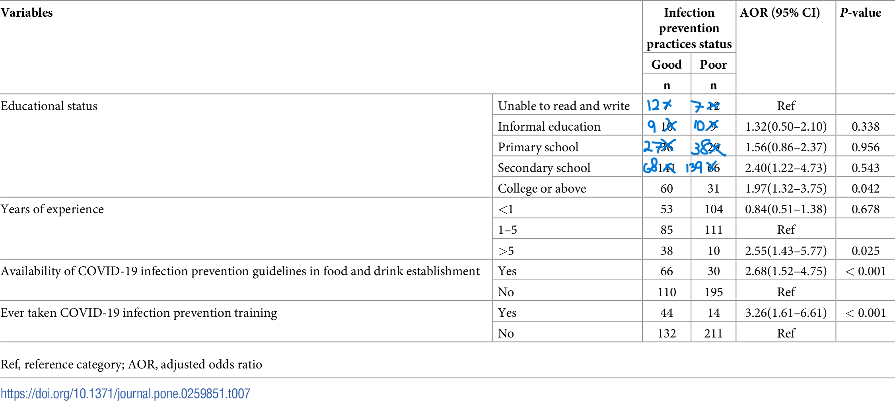
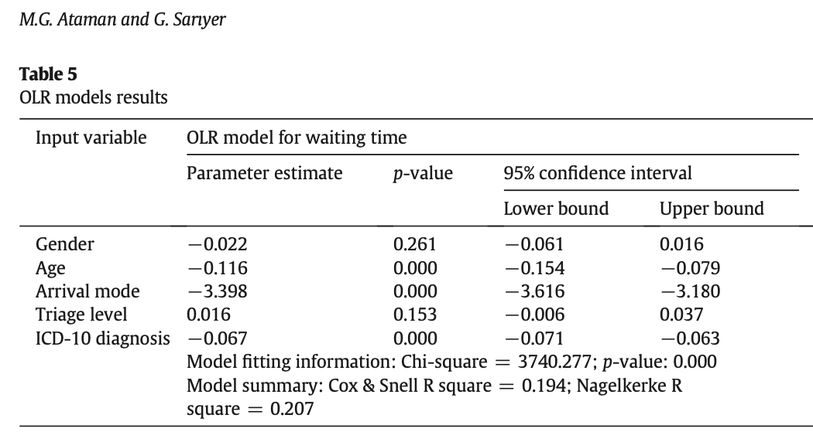
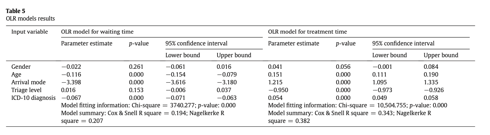

## Setup

```{r , message=FALSE, warning=FALSE}
library(tidyverse)
library(tidymodels)
library(GGally)
library(knitr)
library(patchwork)
library(viridis)
library(ggfortify)
library(gridExtra)
```


## Learning goals {.smaller}

- Identify Bernoulli and binomial random variables

- Write GLM for binomial response variable 

- Interpret the coefficients for a logistic regression model 

- Visualizations for logistic regression

- Interpret coefficients and results from an ordinal logistic regression model 


# Basics of logistic regression
## Bernoulli + Binomial random variables (1/2) {.smaller}

Logistic regression is used to analyze data with two types of responses: 

- **Binary**: These responses take on two values: success $(Y = 1)$ or failure $(Y = 0)$, yes $(Y = 1)$ or no $(Y = 0)$, etc.

. . .

$$P(Y = y) = p^y(1-p)^{1-y} \hspace{10mm} y = 0, 1$$

## Bernoulli + Binomial random variables (2/2)  {.smaller}

Logistic regression is used to analyze data with two types of responses: 

- **Binomial**: Number of successes in a Bernoulli process, $n$ independent trials with a constant probability of success $p$. 

. . .

$$P(Y = y) = {n \choose y}p^{y}(1-p)^{n - y} \hspace{10mm} y = 0, 1, \ldots, n$$

. . .

In both instances, the goal is to model $p$ the probability of success.


## Binary vs. Binomial data {.smaller}

For each example, identify if the response is a Bernoulli or Binomial response


1. Use median age and unemployment rate in a county to predict the percent of Obama votes in the county in the 2008 presidential election.

2. Use GPA and MCAT scores to estimate the probability a student is accepted into medical school.

3. Use sex, age, and smoking history to estimate the probability an individual has lung cancer.

4. Use offensive and defensive statistics from the 2017-2018 NBA season to predict a team's winning percentage.

## Logit link {.smaller}

Bernoulli and Binomial random variables can be written in one-parameter exponential family form, $f(y;\theta) = e^{[a(y)b(\theta) + c(\theta) + d(y)]}$

. . .

**Bernoulli**

$$f(y;p) = e^{y\log(\frac{p}{1-p}) + \log(1-p)}$$

. . .

**Binomial** 

$$f(y;n,p) = e^{y\log(\frac{p}{1-p}) + n\log(1-p) + \log{n \choose y}}$$

. . .

They have the same canonical link $b(p) = \log\big(\frac{p}{1-p}\big)$


## Logistic regression model {.smaller}

So the glm model for both cases is: 

$\log\Big(\frac{p}{1-p}\Big) = \beta_0 + \beta_1x_1 + \beta_2x_2 + \dots + \beta_px_p$

- The response variable, $\log\Big(\frac{p}{1-p}\Big)$, is the log(odds) of success, i.e. the logit


- Use the model to calculate the probability of success $\hat{p} = \frac{e^{\beta_0 + \beta_1x_1 + \beta_2x_2 + \dots + \beta_px_p}}{1 + e^{\beta_0 + \beta_1x_1 + \beta_2x_2 + \dots + \beta_px_p}}$


- When the response is a Bernoulli random variable, the probabilities can be used to classify each observation as a success or failure


## Logistic vs linear regression model {.smaller}

:::{.panel-tabset}

### Plot
```{r, OLSlogistic, fig.align="center", fig.cap='Graph from BMLR Chapter 6', echo=FALSE, warning=FALSE, message=FALSE}

set.seed(0)
dat <- tibble(x=runif(200, -5, 10),
                  p=exp(-2+1*x)/(1+exp(-2+1*x)),
                  y=rbinom(200, 1, p),
                  y2=.3408+.0901*x,
                  logit=log(p/(1-p)))
dat2 <- tibble(x = c(dat$x, dat$x),
               y = c(dat$y2, dat$p),
               `Regression model` = c(rep("linear", 200),
                                      rep("logistic", 200)))

ggplot() + 
  geom_point(data = dat, aes(x, y)) +
  geom_line(data = dat2, aes(x, y, linetype = `Regression model`, 
                             color = `Regression model`)) + 
  labs(title = "Linear vs. logistic regression models for binary response data") + 
  scale_colour_manual(name = 'Regression model',
                      values = c('blue', 'red'), 
                      labels = c('linear', 'logistic'), guide ='legend')
```


### Code

```{r, OLSlogistic2, fig.align="center", fig.cap='Graph from BMLR Chapter 6', eval = F, warning=FALSE, message=FALSE}

set.seed(0)
dat <- tibble(x=runif(200, -5, 10),
                  p=exp(-2+1*x)/(1+exp(-2+1*x)),
                  y=rbinom(200, 1, p),
                  y2=.3408+.0901*x,
                  logit=log(p/(1-p)))
dat2 <- tibble(x = c(dat$x, dat$x),
               y = c(dat$y2, dat$p),
               `Regression model` = c(rep("linear", 200),
                                      rep("logistic", 200)))

ggplot() + 
  geom_point(data = dat, aes(x, y)) +
  geom_line(data = dat2, aes(x, y, linetype = `Regression model`, 
                             color = `Regression model`)) + 
  labs(title = "Linear vs. logistic regression models for binary response data") + 
  scale_colour_manual(name = 'Regression model',
                      values = c('blue', 'red'), 
                      labels = c('linear', 'logistic'), guide ='legend')
```

:::


## Assumptions for logistic regression {.smaller}

The following assumptions need to be satisfied to use logistic regression to make inferences

. . .

`r emo::ji("one")` $\hspace{0.5mm}$ **Binary response**: The response is dichotomous (has two possible outcomes) or is the sum of dichotomous responses

`r emo::ji("two")` $\hspace{0.5mm}$ **Independence**: The observations must be independent of one another 

`r emo::ji("three")` $\hspace{0.5mm}$ **Variance structure**: Variance of a binomial random variable is $np(1-p)$ $(n = 1 \text{ for Bernoulli})$ , so the variability  is highest when $p = 0.5$

`r emo::ji("four")` $\hspace{0.5mm}$  **Linearity**: The log of the odds ratio, $\log\big(\frac{p}{1-p}\big)$, must be a linear function of the predictors $x_1, \ldots, x_p$


## COVID-19 infection prevention practices at food establishments {.smaller}

Researchers at Wollo Univeristy in Ethiopia conducted a study in July and August 2020 to understand factors associated with good COVID-19 infection prevention practices at food establishments. Their study is published in [Andualem et al. (2022)](https://journals.plos.org/plosone/article?id=10.1371/journal.pone.0259851#ack) 

<br> 

They were particularly interested in the understanding implementation of prevention practices at food establishments, given the workers' increased risk due to daily contact with customers. 

:::aside
Andualem, A., Tegegne, B., Ademe, S., Natnael, T., Berihun, G., Abebe, M., ... & Adane, M. (2022). COVID-19 infection prevention practices among a sample of food handlers of food and drink establishments in Ethiopia. PloS one, 17(1), e0259851.
:::


## The data {.smaller}

*"An institution-based cross-sectional study was conducted among <b>422 food handlers in Dessie City and Kombolcha Town food and drink establishments in July and August 2020.</b> The study participants were selected using a <b>simple random sampling</b> technique. Data were collected by trained data collectors using a pretested structured questionnaire and an on-the-spot observational checklist."*


:::aside
Andualem, A., Tegegne, B., Ademe, S., Natnael, T., Berihun, G., Abebe, M., ... & Adane, M. (2022). COVID-19 infection prevention practices among a sample of food handlers of food and drink establishments in Ethiopia. PloS one, 17(1), e0259851.
:::


## Response variable {.smaller}

*"The outcome variable of this study was the <b>good or poor practices of COVID-19 infection prevention among food handlers</b>. Nine yes/no questions, one observational checklist and five multiple choice infection prevention practices questions were asked with a minimum score of 1 and maximum score of 25. Good infection prevention practice (the variable of interest) was determined for food handlers who scored 75% or above, whereas poor infection prevention practices refers to those food handlers who scored below 75% on the practice questions."* 


:::aside
Andualem, A., Tegegne, B., Ademe, S., Natnael, T., Berihun, G., Abebe, M., ... & Adane, M. (2022). COVID-19 infection prevention practices among a sample of food handlers of food and drink establishments in Ethiopia. PloS one, 17(1), e0259851.
:::


## Results

{width=90%}

:::aside
Andualem, A., Tegegne, B., Ademe, S., Natnael, T., Berihun, G., Abebe, M., ... & Adane, M. (2022). COVID-19 infection prevention practices among a sample of food handlers of food and drink establishments in Ethiopia. PloS one, 17(1), e0259851.
:::


## Interpreting the results {.smaller}

- Is the response a Bernoulli or Binomial? 

- What is the strongest predictor of having good COVID-19 infection prevention practices?
  - It's often unreliable to answer this question just based on the model output. Why are we able to answer this question based on the model output in this case? 
  
- Describe the effect (coefficient interpretation and inference) of having COVID-19 infection prevention policies available at the food establishment. 

- The intercept describes what group of food handlers? 


# Visualizations for logistic regression

## Access to personal protective equipment {.smaller}

We will use the data from [Andualem et al. (2022)](https://journals.plos.org/plosone/article?id=10.1371/journal.pone.0259851#ack) to explore the association between age, sex, years of service, and whether someone works at a food establishment with access to personal protective equipment (PPE) as of August 2020. We will use access to PPE as a proxy for wearing PPE. 

::: {.panel-tabset}

### Data 

```{r echo = F}
covid_df <- read_csv("data/covid-prevention-study.csv") |>
  rename(age = "Age of food handlers", 
         years = "Years of service", 
         ppe_access = "Availability of PPEs") |>
  mutate(sex = factor(if_else(Sex == 2, "Female", "Male"))) |>
  select(age, sex, years, ppe_access) 

covid_df |> slice(1:5) |> kable()
```

### Code

```{r eval = F}
covid_df <- read_csv("data/covid-prevention-study.csv") |>
  rename(age = "Age of food handlers", 
         years = "Years of service", 
         ppe_access = "Availability of PPEs") |>
  mutate(sex = factor(if_else(Sex == 2, "Female", "Male"))) |>
  select(age, sex, years, ppe_access) 

covid_df |> slice(1:5) |> kable()
```

:::

## EDA for binary response (1/2)

```{r, out.width = "60%"}
library(Stat2Data)
par(mfrow = c(1, 2))
emplogitplot1(ppe_access ~ age, data = covid_df, ngroups = 10)
emplogitplot1(ppe_access ~ years, data = covid_df, ngroups = 5)
```


## EDA for binary response (2/2) {.smaller}

:::{.panel-tabset}

### plot

```{r, echo=F}
library(viridis)
ggplot(data = covid_df, aes(x = sex, fill = factor(ppe_access))) + 
  geom_bar(position = "fill")  +
  labs(x = "Sex", 
       fill = "PPE Access", 
       title = "PPE Access by Sex") + 
  scale_fill_viridis_d()
```

### Code 

```{r, eval = F}
library(viridis)
ggplot(data = covid_df, aes(x = sex, fill = factor(ppe_access))) + 
  geom_bar(position = "fill")  +
  labs(x = "Sex", 
       fill = "PPE Access", 
       title = "PPE Access by Sex") + 
  scale_fill_viridis_d()
```

:::


## Model results {.smaller}

```{r}
ppe_model <- glm(factor(ppe_access) ~ age + sex + years, data = covid_df, 
                 family = binomial)
tidy(ppe_model, conf.int = TRUE) |>
  kable(digits = 3)
```


## Visualizing coefficient estimates {.smaller}


```{r}
model_coef <- tidy(ppe_model, exponentiate = TRUE, conf.int = TRUE)
```

```{r, out.width = "55%"}
ggplot(data = model_coef, aes(x = term, y = estimate)) +
  geom_point() +
  geom_hline(yintercept = 1, lty = 2) + 
  geom_pointrange(aes(ymin = conf.low, ymax = conf.high))+
  labs(title = "Exponentiated model coefficients") + 
  coord_flip()
```


# Logistic regression for binomial response variable

## Data: Supporting railroads in the 1870s {.smaller}

The data set [`RR_Data_Hale.csv`](data/RR_Data_Hale.csv) contains information on support for referendums related to railroad subsidies for 11 communities in Alabama in the 1870s. The data were originally analyzed as part of a thesis project by a student at St. Olaf College. The variables in the data are 

- `pctBlack`: percentage of Black residents in the county 
- `distance`: distance the proposed railroad is from the community (in miles)
- `YesVotes`: number of "yes" votes in favor of the proposed railroad line 
- `NumVotes`: number of votes cast in the election 

. . .

**Primary question**: Was voting on the railroad referendum related to the distance from the proposed railroad line, after adjusting for the racial composition of a community?


## The data {.smaller}

```{r}
rr <- read_csv("data/RR_Data_Hale.csv")
rr |> slice(1:5) |> kable()
```


## EDA (1/3) {.smaller}

```{r}
rr <- rr |>
  mutate(pctYes = YesVotes/NumVotes, 
         emp_logit = log(pctYes / (1 - pctYes)))

rr |> head(5)
```

## EDA (2/3) {.smaller}

:::{.panel-tabset}

### Plot 

```{r echo = F}
p1 <- ggplot(data = rr, aes(x = distance, y = emp_logit)) + 
  geom_point() + 
  geom_smooth(method  = "lm", se = FALSE) + 
  labs(x = "Distance to proposed railroad", 
       y = " ")
  
p2 <- ggplot(data = rr, aes(x = pctBlack, y = emp_logit)) + 
  geom_point() + 
  geom_smooth(method  = "lm", se = FALSE) + 
  labs(x = "% Black residents", 
       y = "")
p1 + p2 + plot_annotation(title = "Log(odds yes vote) vs. predictor variables")
```

### Code

```{r eval = F}
p1 <- ggplot(data = rr, aes(x = distance, y = emp_logit)) + 
  geom_point() + 
  geom_smooth(method  = "lm", se = FALSE) + 
  labs(x = "Distance to proposed railroad", 
       y = " ")
  
p2 <- ggplot(data = rr, aes(x = pctBlack, y = emp_logit)) + 
  geom_point() + 
  geom_smooth(method  = "lm", se = FALSE) + 
  labs(x = "% Black residents", 
       y = "")
p1 + p2 + plot_annotation(title = "Log(odds yes vote) vs. predictor variables")
```

:::

## EDA (3/3) {.smaller}

```{r}
rr <- rr |>
  mutate(inFavor = if_else(pctYes > 0.5, "Yes", "No"))
```

::: {.panel-tabset}

### Plot

```{r echo = F, warning=F,message=F}
ggplot(data = rr, aes(x = distance, y = pctBlack, color = inFavor)) + 
  geom_point() + 
  geom_smooth(method  = "lm", se = FALSE, aes(lty = inFavor)) + 
  labs(x = "Distance to proposed railroad", 
       y = "% Black residents",
       title = "% Black residents vs. distance", 
       subtitle = "Based on vote outcome. Check for potential multicollinearity and interaction effect") + 
  scale_color_viridis_d(end = 0.85)
```

### Code 

```{r eval = F}
ggplot(data = rr, aes(x = distance, y = pctBlack, color = inFavor)) + 
  geom_point() + 
  geom_smooth(method  = "lm", se = FALSE, aes(lty = inFavor)) + 
  labs(x = "Distance to proposed railroad", 
       y = "% Black residents",
       title = "% Black residents vs. distance", 
       subtitle = "Based on vote outcome. Check for potential multicollinearity and interaction effect") + 
  scale_color_viridis_d(end = 0.85)
```

:::


## Model 

Let $p$ be the percent of yes votes in a county. We'll start by fitting the following model: 

$$\log\Big(\frac{p}{1-p}\Big)  = \beta_0 + \beta_1 ~ dist + \beta_2 ~ pctBlack$$


## Model in R {.smaller}

```{r}
rr_model <- glm(cbind(YesVotes, NumVotes - YesVotes) ~ distance + pctBlack, 
                data = rr, family = binomial)
tidy(rr_model, conf.int = TRUE) |>
  kable(digits = 3)
```

. . .

$$\log\Big(\frac{\hat{p}}{1-\hat{p}}\Big)  = 4.22 - 0.292 ~ dist - 0.013 ~ pctBlack$$

::: aside
See Section 6.5 of *Generalized Linear Models with Examples in R* by Dunn and Smyth (available through Duke library) for details on estimating the standard errors.
:::


## Residuals {.smaller}

For logistic regression, there are two types of residuals: Pearson and deviance residuals

. . .

**Pearson residuals** 

Pearson residuals look at the differences between actual and predicted counts.

$$\text{Pearson residual}_i = \frac{\text{actual count} - \text{predicted count}}{\text{SD count}} = \frac{Y_i - m_i\hat{p}_i}{\sqrt{m_i\hat{p}_i(1 - \hat{p}_i)}}$$

## Deviance residuals {.smaller}

The deviance residual also compare the actual and predicted counts, but do so using the theory of likelihoods.

**Deviance residuals** 

$$d_i = \text{sign}(Y_i - m_i\hat{p}_i)\sqrt{2\left[Y_i\log\left(\frac{Y_i}{m_i\hat{p}_i}\right) + (m_i - Y_i)\log\left(\frac{m_i - Y_i}{m_i - m_i\hat{p}_i}\right)\right]}$$
where 

$$\text{sign}(y_i - m_i\hat{p}_i)  =  \begin{cases}
1 & \text{ if }(y_i - m_i\hat{p}_i) > 0 \\
-1 & \text{ if }(y_i - m_i\hat{p}_i) < 0 \\
0 & \text{ if }(y_i - m_i\hat{p}_i) = 0
\end{cases}$$

## Meaning of Residuals {.smaller}

Both types of residuals indicate how much the observed data deviates from the fitted model. What happens when the actual count and the predicted count are the same for each type of residual?

. . .

$$\text{Pearson residual}_i = \frac{\text{actual count} - \text{predicted count}}{\text{SD count}} = \frac{Y_i - m_i\hat{p}_i}{\sqrt{m_i\hat{p}_i(1 - \hat{p}_i)}}$$

. . .

$$d_i = \text{sign}(Y_i - m_i\hat{p}_i)\sqrt{2\left[Y_i\log\left(\frac{Y_i}{m_i\hat{p}_i}\right) + (m_i - Y_i)\log\left(\frac{m_i - Y_i}{m_i - m_i\hat{p}_i}\right)\right]}$$

## Plot of deviance residuals {.smaller}

:::{.panel-tabset}

### Model {.smaller}

```{r, warning=F,message=F}
rr_int_model <- glm(cbind(YesVotes, NumVotes - YesVotes) ~ distance + pctBlack +
                      distance*pctBlack, 
                data = rr, family = binomial)

rr_int_aug <- augment(rr_int_model, type.predict = "response", 
                        type.residuals = "deviance")

rr_int_aug |> slice(1:5) |> kable()
```


### Residual Plot

```{r echo = F}
ggplot(data = rr_int_aug, aes(x = .fitted, y = .resid)) + 
  geom_point() + 
  geom_hline(yintercept = 0, color = "red") + 
  labs(x = "Fitted values", 
       y = "Deviance residuals", 
       title = "Deviance residuals vs. fitted", 
       subtitle = "for model with interaction term")
```

### Plot Code

```{r eval = F}
ggplot(data = rr_int_aug, aes(x = .fitted, y = .resid)) + 
  geom_point() + 
  geom_hline(yintercept = 0, color = "red") + 
  labs(x = "Fitted values", 
       y = "Deviance residuals", 
       title = "Deviance residuals vs. fitted", 
       subtitle = "for model with interaction term")
```

:::

## Goodness of fit {.smaller}

We use the sum of the squared deviance residuals to assess goodness of fit of the model. 

$$\begin{aligned} &H_0: \text{ Model is a good fit} \\
&H_a: \text{ Model is not a good fit}\end{aligned}$$


- When $m_i$ is large and the model is a good fit $(H_0 \text{ true})$ the residual deviance follows a $\chi^2$ distribution with $n - p$ degrees of freedom. 
  - Recall $n - p$ is the residual degrees of freedom.

- If the model fits, we expect the residual deviance to be approximately what value? 

## Goodness of fit test {.smaller}

:::{.panel-tabset}

### Model {.smaller}

```{r, warning=F,message=F}
rr_int_model <- glm(cbind(YesVotes, NumVotes - YesVotes) ~ distance + pctBlack +
                      distance*pctBlack, 
                data = rr, family = binomial)

rr_int_model
```


### Test 

The test statistic is the residual deviance: 274.2

The degrees of freedom are the residual df: 7

We find the p-value using the chi-square distribution r function


```{r}

1-pchisq(274.2, 7)

```

The p-value is quite small, so there is significant evidence that the model is not a good fit.
:::

## Drop-in-deviance test {.smaller}

Is our last model better than just a model with distance in it?  We can test that with a drop-in-deviance test.

:::{.panel-tabset}

### Test information

The hypotheses are:

$$\begin{aligned} &H_0: \text{ Simpler model is enough} \\
&H_a: \text{ More complete model is better}\end{aligned}$$

- Note that one observation was omitted in the more complicated model because it was missing the race information.  To compare the models, we must use the same exact data set, so in running the simpler model, I eliminated that data point.

### Simpler Model {.smaller}

```{r, warning=F,message=F}
rr_simp_model <- glm(cbind(YesVotes, NumVotes - YesVotes) ~ distance, 
                data = rr[-11,], family = binomial)

rr_simp_model
```


### Test 


```{r}

drop_in_dev <- anova(rr_simp_model, rr_int_model, test= "Chisq")
drop_in_dev

```

So even though there are issues with the larger model, it is significantly better than the simpler one.

:::

# Overdispersion 

## Overdispersion  {.smaller}

**Overdispersion**: There is more variability in the response than what is assumed by the Logistic model 

:::{.panel-tabset}

### Estimated variance

:::: {.columns}

::: {.column}

**Overall $\hat{p}$**

```{r}

over_p_hat <- sum(rr$YesVotes)/sum(rr$NumVotes)
over_p_hat

```

:::

::: {.column}

**$\hat{p}$ by Location summary stats**

```{r}
rr |> mutate(p_hat = YesVotes/NumVotes) |>
  summarise(mean = mean(p_hat), var = var(p_hat)) |>
  kable(digits = 3)
```

:::

::::

### Binomial variance

The variance for the count in a binomial setting is $np(1-p)$.  Here we want the variance of $\hat{p}$ instead of the count.  That variance is $\frac{p(1-p)}{n}$

```{r echo=T}
var_p_hat <- over_p_hat*(1-over_p_hat)/12
var_p_hat
```

Notice that our estimated variance of $\hat{p}$ is 0.148, but our model assumes a variance of approximately 0.009.

:::

## Why overdispersion matters {.smaller}

If there is overdispersion, then there is more variation in the response than what's assumed by a Binomial model. This means 

`r emo::ji("x")`  The standard errors of the model coefficients are artificially small 

`r emo::ji("x")`  The p-values are artificially small 

`r emo::ji("x")`  This could lead to models that are more complex than what is needed 

. . .

We can take overdispersion into account by

  - inflating standard errors by multiplying them by a dispersion factor
 

## Dispersion parameter  {.smaller}

The **dispersion parameter** is represented by $\phi$


$$\hat{\phi} =\frac{\text{deviance}}{\text{residual df}} = \frac{\sum_{i=1}^{n}(\text{Pearson residuals})^2}{n - p}$$

where $p$ is the number of terms in the model (including the intercept)


- If there is no overdispersion $\hat{\phi} = 1$

- If there is overdispersion $\hat{\phi} >  1$


## Adjusting for overdispersion (1/2) {.smaller} 


- We can adjust for overdispersion in the binomial regression model by using a dispersion parameter $$\hat{\phi} = \sum \frac{(\text{Pearson residuals})^2}{n-p}$$
  -  By multiplying by $\hat{\phi}$, we are accounting for the reduction in information we would expect from independent observations. 


## Adjusting for overdispersion (2/2) {.smaller}

- We adjust for overdispersion using a **quasibinomial** model. 
  - "Quasi" reflects the fact we are no longer using a binomial model with true likelihood. 
  
- The standard errors of the coefficients are $SE_{Q}(\hat{\beta}_j) = \sqrt{\hat{\phi}} SE(\hat{\beta})$
  - Inference is done using the $t$ distribution to account for extra variability 


<!-- # Predicting emergency department wait and treatment times  -->


<!-- ## Predicting ED wait and treatment times {.smaller} -->

<!-- [Ataman and Sariyer (2021)](https://sakai.duke.edu/access/content/group/ec265469-bdb3-47a7-beb0-317956b6f86f/ataman-sariyer-2021.pdf) use ordinal logistic regression to predict patient wait and treatment times in an emergency department (ED).  The goal is to identify relevant factors that can be used to inform recommendations for reducing wait and treatment times, thus improving the quality of care in the ED.  -->

<!-- **Data**: Daily records for ED arrivals in August 2018 at a public hospital in Izmir, Turkey.  -->

<!-- **Response variable**: Wait time, a categorical variable with three levels:  -->
<!--   - Patients who wait less than 10 minutes -->
<!--   - Patients whose waiting time is in the range of 10-60 minutes -->
<!--   - Patients who wait more than 60 minutes -->


<!-- ::: aside -->
<!-- Ataman, M. G., & Sarıyer, G. (2021). Predicting waiting and treatment times in emergency departments using ordinal logistic regression models. The American Journal of Emergency Medicine, 46, 45-50. -->
<!-- ::: -->


<!-- ## Ordinal logistic regression {.smaller} -->

<!-- Let $Y$ be an ordinal response variable that takes levels $1, 2, \ldots, J$ with associated probabilities $p_1, p_2, \ldots, p_J$.  -->

<!-- The **proportional odds model** can be written as the following: -->

<!-- $$\begin{aligned}&\log\Big(\frac{P(Y\leq 1)}{P(Y > 1)}\Big) = \beta_{01} + \beta_1x_1 + \dots +  \beta_px_p \\ -->
<!-- & \log\Big(\frac{P(Y\leq 2)}{P(Y > 2)}\Big) = \beta_{02} + \beta_1x_1 + \dots +  \beta_px_p \\ -->
<!-- & \dots \\ -->
<!-- & \log\Big(\frac{P(Y\leq J-1)}{P(Y > J-1)}\Big) = \beta_{0{J-1}} + \beta_1x_1 + \dots +  \beta_px_p\end{aligned}$$ -->

<!-- ## Questions -->

<!--   - How is the proportional odds model similar to the multinomial logistic model?  -->
<!--   - How is it different? -->

<!-- ## Effect of arrival mode {.smaller} -->

<!-- ```{r echo = F, out.width = "100%"} -->

<!--  -->
<!-- ``` -->

<!-- . . . -->

<!-- **Question** -->

<!-- The variable `arrival mode` takes two categories: ambulance and walk-in. Describe the effect of arrival mode in this model. Note that the baseline level is "walk-in". -->


<!-- ## Effect of triage level {.smaller} -->

<!-- . . . -->

<!-- Consider the full output with the ordinal logistic models for wait and treatment times.  -->


<!-- ```{r echo = F, out.width = "90%"} -->
<!--  -->
<!-- ``` -->


<!-- - **Question** -->

<!-- . . . -->

<!-- Use the results from both models to describe the effect of triage level (red = urgent, green = non-urgent) on the wait and treatment times in the ED. Note that "red" is the baseline level. Is this what you expected?  -->

  
  

## Acknowledgements

These slides are based on content in 

- [BMLR: Chapter 6 - Logistic Regression](https://bookdown.org/roback/bookdown-BeyondMLR/ch-logreg.html)

- Initial versions of the slides are by Dr. Maria Tackett, Duke University
- Originally edited by Tyler George

  
